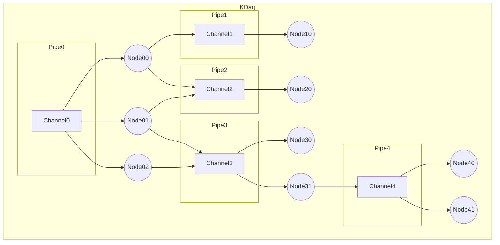

# KDag

---

KDag is a [Kotlin](https://kotlinlang.org/) library which makes concurrent data processing pipeline safe, scalable & easy to develop.

KDag is built on top of Kotlin [Channels](https://kotlinlang.org/api/kotlinx.coroutines/kotlinx-coroutines-core/kotlinx.coroutines.channels/-channel/).
It provides APIs to describe your data processing workflow as DAG (Directed Acyclic Graph).

Key feature of KDag are:
- Its ability to drain channels to prevent data loss.
- Write concurrent code without worrying about concurrency.
- Identify cycles in data processing pipeline.
- Linearly scale data processing by simply adding consumers.

## Use cases

---

1. Log processing pipeline based on Kotlin Channel, to enable efficient log capture with minimal performance impact. And flushing of all logs in channel before program exit to prevent lost logs.

## How does KDag work?

---

KDag consists of 2 main components:
- Pipe
- Node

### Pipe
A pipe is the communication primitive of KDag.
Pipe is a wrapper of Kotlin Channel which keeps track of producers & consumers of the channel.
The Pipe wrapper enables it to close the channel and consequently consumers when all producers have exited.

### Node
A node is the execution primitive of KDag. Code within a node is executed sequentially & need not be thread safe.
An instance of a Node can only consume from a single pipe, but it can send data to multiple pipes.
Multiple instance of same node class can be created to consume data from the same pipe to scale data processing.

### KDag graph explanation by examples:

#### KDag Graph

#### Examples

##### 1. How does KDag prevent data loss?
Take the example graph above once the regular code of the program has completed a "flush" can be called on KDag instance.
Flush call will be executed as below:
1. KDag will identify the root of the graph which is Channel0.
2. Channel0 will be closed.
3. Closing of channel0 will result in Node00, Node01 & Node02 to exit after processing all the data in Channel0.
4. Node00 will notify Pipe1 & Pipe2 that it has exited.
5. Similarly, Node01 will notify Pipe2 & Pipe3.
6. Similarly, Node02 will notify Pipe3.
7. Pipe1 will identify that all it's producers(Node00) have exited, so it will close Channel1.
8. Similarly, Pipe2 will identify that all it's producers(Node00, Node01) have exited, so it will close Channel2.
9. Similarly, Pipe3 will identify that all it's producers(Node01, Node02) have exited, so it will close Channel3.
10. Closing of Channel1, Channel2 & Channel3 will result in closing of their subgraph similar to step 2 above.

As per above a channel is only closed once all data in the upstream channels has been consumed & all upstream processing is complete thus ensuring no data is lost.

##### 2. How does KDag provide ability to write concurrent code without worrying about concurrency?
All the code inside a KDag execution model is run within a node which is nothing but a sequential processor polling a single channel.

##### 3. How does KDag identify cycles in data processing pipeline?
KDag uses depth first search algorithm to identify cycles in the execution graph.

#### 4. How do you scale KDag processing
KDag processing can be scaled by adding multiple instances of same node class to poll the same channel.
This will increase the data processing throughput.

## Consultation
The project is in consultation phase. The goals of the consultation phase are:
1. Identify if this library will be useful for others?
   - If this is something that will be useful to you please star the project on GitHub.
2. Is this a rework. i.e. are there any existing Kotlin projects which achieve the feature goals of this library.
3. Additional details that should be included in the README.
